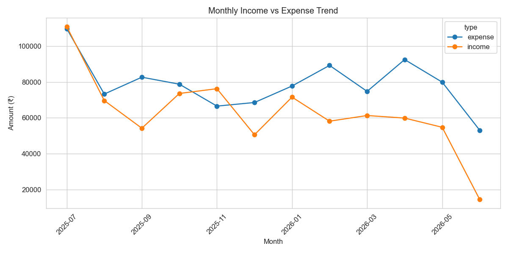
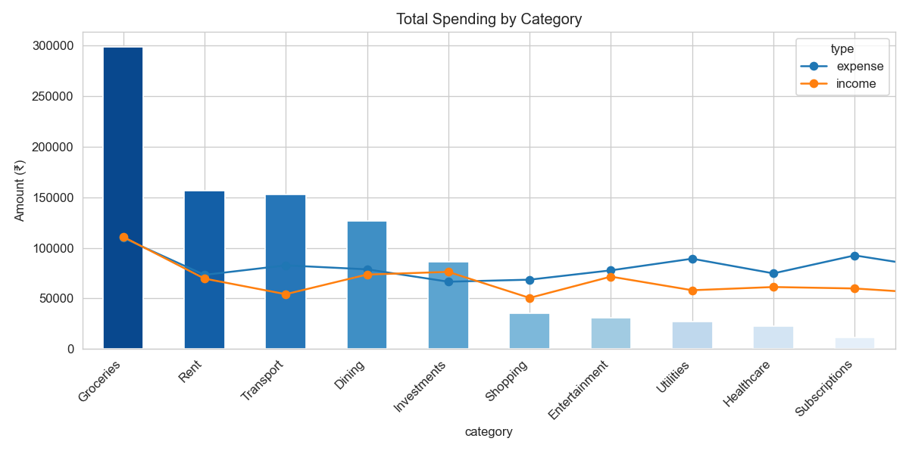
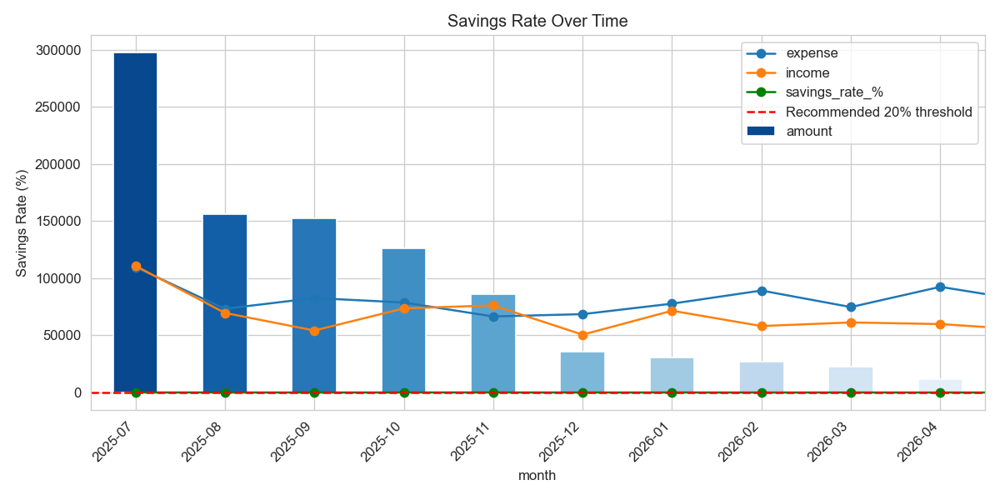
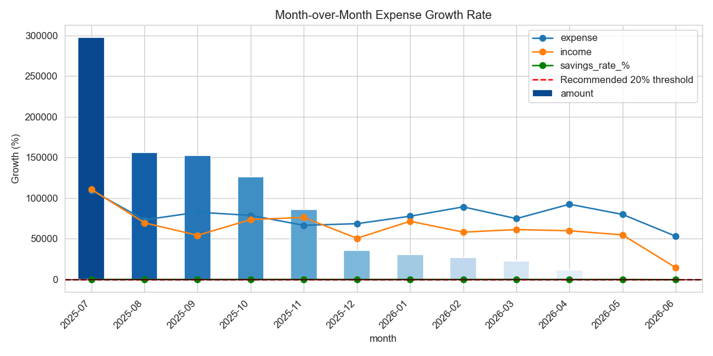
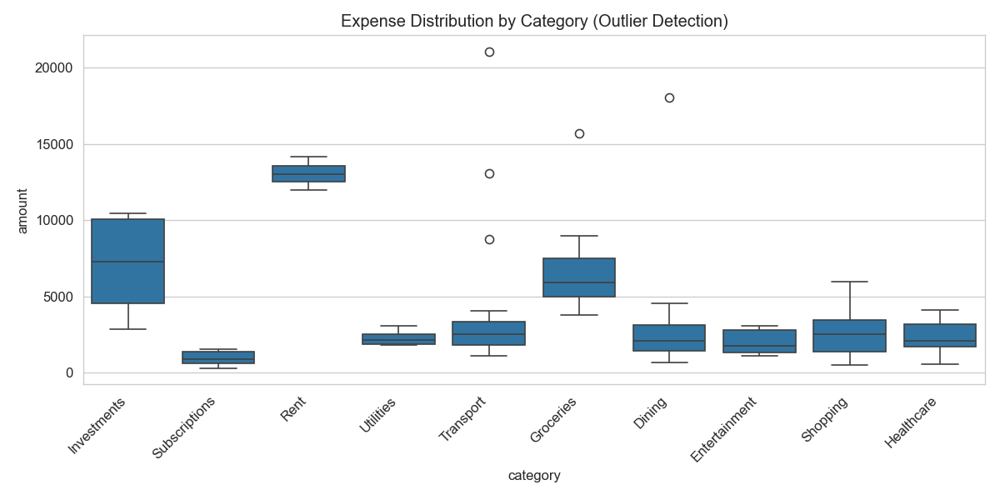
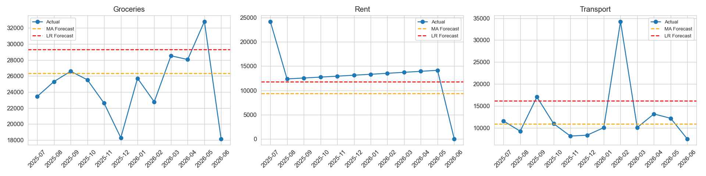

# AI Finance Tracker


A full-stack personal finance application that helps users track income and expenses, manage budgets, visualize cash flow, and receive AI-powered financial insights. Built with the MERN stack and a modern React dashboard inspired by premium fintech products.

---

## Overview

AI Finance Tracker is a comprehensive personal finance management solution designed for individuals who want to take control of their financial health. The application provides real-time tracking of income and expenses, budget management tools, AI-powered financial insights, and beautiful visualizations to help users understand their spending patterns. With its modern, responsive interface and intelligent features, it makes financial management both powerful and accessible.

---

## Features

### Authentication & Security
- User registration and login with JWT (JSON Web Tokens)
- Protected API routes with middleware authentication
- Client-side route guards for protected pages
- Secure password hashing with bcryptjs
- Session persistence with token-based authentication
- Profile page with account details and secure logout

### Financial Management
- **Dashboard** — Comprehensive overview with income, expenses, savings, budget remaining, trend charts, category breakdown, and recent transactions
- **Transactions** — Full CRUD operations for income and expense entries with categorization
- **Budget** — Set monthly budgets with real-time spending progress tracking and visual indicators
- **Reports** — Generate detailed monthly financial summaries with downloadable PDF reports

### AI-Powered Features
- **AI Insights** — Personalized financial recommendations via OpenAI GPT-4o-mini with intelligent heuristic fallback
- **AI Chat** — Interactive conversational AI for real-time financial advice and queries
- **Expense Prediction** — Machine learning-based spending forecasts and budget risk scoring
- **Smart Categorization** — Automatic transaction categorization using AI analysis

### User Experience
- Responsive layout with collapsible sidebar (mobile-friendly design)
- Premium minimalist fintech UI with Tailwind CSS 4
- Smooth animations with Framer Motion
- Interactive charts and visualizations with Recharts
- Redux Toolkit for predictable global state management
- Loading skeletons and smooth page transitions
- Glassmorphism design elements
- Modern sidebar navigation

---

## Data & Insights

This project analyzes transaction-level income and expense records, monthly cash-flow trends, savings behavior, category-level spending, and budget targets to surface decision-ready financial insights.

### What Data Is Analyzed
- **Transactions** — income and expense entries with amount, category, and transaction date
- **Cash Flow History** — month-by-month income, expenses, and net savings patterns
- **Budget Data** — monthly and category budget targets compared against actual spend
- **Category Behavior** — recurring category spend, volatility, and spending outliers

### Methods Used
- **Aggregation** — monthly rollups, category totals, savings rate, burn rate, and budget variance calculations
- **Regression / Forecasting** — notebook-based trend analysis and expense forecasting using linear modeling techniques
- **Anomaly Detection** — outlier detection on unusual transactions and category spend spikes using distribution-based thresholds

### Example Insights Surfaced
- Average monthly income was ₹62,955 versus average monthly expense of ₹78,914, producing an average monthly deficit of ₹15,959
- The average savings rate was -44.8%, and all 12 months in the sample were below the 20% recommended threshold
- The largest expense categories were Groceries (31.5%), Rent (16.5%), and Transport (16.1%) of total expense volume
- The analysis flagged 19 anomalous transactions using an IQR threshold of ₹10,075 and identified Dining as 362% over budget in June 2026
- The forecasting model projected Groceries as the highest-spend category next month at ₹29,326

### Run the Jupyter Notebooks
1. Install **Python 3.10+**.
2. Install the notebook dependencies:

```bash
pip install pandas matplotlib seaborn scikit-learn statsmodels jupyter
```

3. Start Jupyter:

```bash
jupyter notebook
```

4. Open either notebook from the `analytics/notebook/` directory:
- `financial_analysis.ipynb`
- `expense_forecasting.ipynb`

### Case Study
- Read the full narrative and chart walkthrough in [CASE_STUDY.md](CASE_STUDY.md)

---

## Tech Stack

### Frontend
- **React 19.2.6** — UI library
- **Vite 8.0.12** — Build tool and dev server
- **Tailwind CSS 4.3.0** — Utility-first CSS framework
- **React Router 7.15.0** — Client-side routing
- **Redux Toolkit 2.11.2** — State management
- **Axios 1.16.0** — HTTP client
- **Recharts 2.15.4** — Charting library
- **Framer Motion 12.38.0** — Animation library
- **Lucide React 1.16.0** — Icon library

### Backend
- **Node.js** — JavaScript runtime
- **Express 4.18.2** — Web framework
- **MongoDB** — NoSQL database
- **Mongoose 9.6.2** — ODM for MongoDB
- **JWT 9.0.3** — Authentication tokens
- **bcryptjs 3.0.3** — Password hashing
- **OpenAI 6.37.0** — AI API integration
- **PDFKit 0.18.0** — PDF generation
- **CORS 2.8.6** — Cross-origin resource sharing
- **Helmet 8.1.0** — Security headers
- **express-rate-limit 8.5.1** — Rate limiting
- **dotenv 17.4.2** — Environment variables

### Development Tools
- **ESLint 10.3.0** — Code linting
- **PostCSS 8.5.14** — CSS processing
- **Autoprefixer 10.5.0** — CSS vendor prefixes
- **nodemon 3.1.14** — Auto-restart server

---

## Project Structure

```
AI-Finance-Tracker/
├── analytics/                      # Data analysis notebooks, scripts, outputs, and queries
│   ├── data/                        # Synthetic transaction data and generation scripts
│   │   ├── generate_data.py         # Synthetic data generator
│   │   └── sample_transactions.csv # Sample transaction dataset
│   ├── notebooks/                  # Executable analysis and forecasting notebooks
│   │   ├── financial_analysis.ipynb
│   │   ├── financial_analysis.py
│   │   ├── expense_forecasting.ipynb
│   │   └── expense_forecasting.py
│   ├── outputs/                    # Saved analysis charts as PNGs
│   └── queries/                    # MongoDB and SQL aggregation examples
├── client/                          # React frontend (Vite)
│   ├── public/                      # Static assets
│   ├── src/
│   │   ├── components/             # Reusable UI components
│   │   │   ├── charts/              # Chart components (ChartTooltip)
│   │   │   ├── ui/                  # UI components (Alert, Button, Card, Input, PageHeader, Skeleton, StatCard)
│   │   │   ├── AuthInitializer.jsx  # Authentication initialization
│   │   │   ├── Loader.jsx           # Loading spinner
│   │   │   ├── Navbar.jsx           # Navigation bar
│   │   │   ├── ProtectedRoute.jsx   # Route guard for protected pages
│   │   │   ├── PublicRoute.jsx      # Route guard for public pages
│   │   │   ├── RootRedirect.jsx     # Root route redirection
│   │   │   └── Sidebar.jsx          # Sidebar navigation
│   │   ├── context/                 # React contexts
│   │   │   └── SidebarContext.jsx   # Sidebar state management
│   │   ├── layouts/                 # Layout components
│   │   │   └── MainLayout.jsx       # Main application layout
│   │   ├── pages/                   # Page components
│   │   │   ├── Budget.jsx           # Budget management page
│   │   │   ├── Chat.jsx             # AI Chat interface
│   │   │   ├── Dashboard.jsx        # Main dashboard
│   │   │   ├── Insights.jsx         # AI insights page
│   │   │   ├── Login.jsx            # Login page
│   │   │   ├── Profile.jsx          # User profile page
│   │   │   ├── Reports.jsx          # Reports page
│   │   │   ├── Signup.jsx           # Signup page
│   │   │   └── Transactions.jsx     # Transactions management
│   │   ├── redux/                   # Redux store and slices
│   │   │   ├── authSlice.js         # Authentication state
│   │   │   ├── budgetSlice.js       # Budget state
│   │   │   ├── chatSlice.js         # Chat state
│   │   │   ├── insightSlice.js      # Insights state
│   │   │   ├── store.js             # Redux store configuration
│   │   │   └── transactionSlice.js  # Transactions state
│   │   ├── routes/                  # Route configuration
│   │   │   ├── AppRoutes.jsx        # Main routes component
│   │   │   └── paths.js             # Route path constants
│   │   ├── services/                # API services
│   │   │   └── api.js               # Axios API client
│   │   ├── utils/                   # Utility functions
│   │   │   ├── categories.js        # Transaction categories
│   │   │   ├── constants.js        # Application constants
│   │   │   └── formatCurrency.js    # Currency formatting
│   │   ├── App.jsx                  # Root App component
│   │   ├── index.css                # Global styles
│   │   └── main.jsx                 # Application entry point
│   ├── index.html                   # HTML template
│   ├── package.json                 # Frontend dependencies
│   ├── postcss.config.js            # PostCSS configuration
│   ├── vite.config.js               # Vite configuration (proxy: /api → localhost:5000)
│   └── tailwind.config.js           # Tailwind CSS configuration
│
├── server/                          # Express API
│   ├── config/                      # Configuration files
│   │   └── db.js                    # MongoDB connection
│   ├── controllers/                 # Route handlers
│   │   ├── aiController.js          # AI endpoints controller
│   │   ├── authController.js        # Authentication controller
│   │   ├── budgetController.js      # Budget controller
│   │   ├── dashboardController.js   # Dashboard controller
│   │   ├── reportController.js      # Reports controller
│   │   └── transactionController.js # Transactions controller
│   ├── middleware/                  # Custom middleware
│   │   └── authMiddleware.js        # JWT authentication middleware
│   ├── models/                      # Mongoose schemas
│   │   ├── Budget.js                # Budget model
│   │   ├── Transaction.js           # Transaction model
│   │   └── User.js                  # User model
│   ├── routes/                      # API route definitions
│   │   ├── aiRoutes.js              # AI routes
│   │   ├── authRoutes.js            # Authentication routes
│   │   ├── budgetRoutes.js          # Budget routes
│   │   ├── dashboardRoutes.js       # Dashboard routes
│   │   ├── reportRoutes.js          # Reports routes
│   │   └── transactionRoutes.js     # Transaction routes
│   ├── services/                    # Business logic services
│   │   ├── aiService.js             # OpenAI integration service
│   │   ├── categorizeService.js     # Transaction categorization
│   │   ├── chatService.js           # AI chat service
│   │   └── financeAnalyzer.js       # Financial analysis logic
│   ├── utils/                       # Utility functions
│   ├── .env                         # Environment variables (not in git)
│   ├── app.js                       # Express app setup
│   ├── package.json                 # Backend dependencies
│   └── server.js                    # Server entry point
│
├── node_modules/                    # Root dependencies
├── package.json                     # Root package.json
├── package-lock.json                # Root lock file
├── .git/                           # Git repository
├── .gitignore                      # Git ignore rules
├── .vscode/                        # VS Code settings
└── README.md                       # This file
```

---

## Prerequisites

- **Node.js** 18 or higher and npm
- **MongoDB** — local instance or [MongoDB Atlas](https://www.mongodb.com/atlas) cluster
- **OpenAI API key** (optional) — enables GPT-powered insights; app works without it using built-in heuristics

---

## Installation

### 1. Clone the repository

```bash
git clone <your-repo-url>
cd AI-Finance-Tracker
```

### 2. Install backend dependencies

```bash
cd server
npm install
```

### 3. Install frontend dependencies

```bash
cd ../client
npm install
```

### 4. Install root dependencies (if any)

```bash
cd ..
npm install
```

---

## Environment Variables

Create a `.env` file inside the `server/` directory:

```env
PORT=5000
MONGODB_URI=mongodb+srv://<username>:<password>@<cluster>.mongodb.net/finance?retryWrites=true&w=majority
JWT_SECRET=your_strong_jwt_secret_here
OPENAI_API_KEY=sk-your_openai_api_key
```

| Variable | Description | Required |
|----------|-------------|----------|
| `PORT` | API server port (default: `5000`) | No |
| `MONGODB_URI` | MongoDB connection string | Yes |
| `JWT_SECRET` | Secret for signing JWT tokens | Yes |
| `OPENAI_API_KEY` | OpenAI key for AI insights | No (optional) |

> **Security:** Never commit `.env` files or real credentials to version control. Use strong secrets in production. The `.env` file is already in `.gitignore`.

---

## Running Locally

You need **two terminals** — one for the API and one for the frontend.

### Terminal 1 — Backend

```bash
cd server
npm run dev
```

Expected output:

```
MongoDB Connected
Server running on port 5000
```

### Terminal 2 — Frontend

```bash
cd client
npm run dev
```

Open the URL shown in the terminal (typically `http://localhost:5173`).

The Vite dev server proxies `/api` requests to `http://localhost:5000`, so the frontend and backend work together without CORS issues during development.

---

## Frontend Routes

| Route | Page | Access | Description |
|-------|------|--------|-------------|
| `/` | Root Redirect | Public | Redirects to login or dashboard based on auth |
| `/login` | Login | Public | User authentication |
| `/signup` | Sign up | Public | User registration |
| `/dashboard` | Dashboard | Protected | Main financial overview |
| `/analytics` | Analytics | Protected | Portfolio-style finance analytics and forecasting page |
| `/transactions` | Transactions | Protected | Manage income and expenses |
| `/budget` | Budget | Protected | Set and track budgets |
| `/insights` | AI Insights | Protected | AI-powered financial recommendations |
| `/chat` | AI Chat | Protected | Interactive AI financial assistant |
| `/reports` | Reports | Protected | Monthly financial reports |
| `/profile` | Profile | Protected | User account settings |

Unauthenticated users are redirected to `/login`. Logged-in users visiting auth pages are redirected to `/dashboard`.

---

## API Reference

Base URL: `http://localhost:5000/api`

Protected routes require header: `Authorization: Bearer <token>`

### Authentication

| Method | Endpoint | Description | Request Body |
|--------|----------|-------------|--------------|
| `POST` | `/auth/signup` | Register new user | `{ name, email, password }` |
| `POST` | `/auth/login` | Login user | `{ email, password }` |
| `GET` | `/auth/me` | Get current user profile | — |

### Transactions

| Method | Endpoint | Description | Request Body |
|--------|----------|-------------|--------------|
| `GET` | `/transactions` | List all transactions | — |
| `POST` | `/transactions` | Create transaction | `{ type, amount, category, description, date }` |
| `PUT` | `/transactions/:id` | Update transaction | `{ type, amount, category, description, date }` |
| `DELETE` | `/transactions/:id` | Delete transaction | — |

### Budget

| Method | Endpoint | Description | Request Body |
|--------|----------|-------------|--------------|
| `GET` | `/budget` | Get user budget | — |
| `POST` | `/budget` | Create or update budget | `{ category, limit, month, year }` |
| `PUT` | `/budget` | Update budget | `{ category, limit, month, year }` |

### Dashboard

| Method | Endpoint | Description |
|--------|----------|-------------|
| `GET` | `/dashboard/summary` | Get aggregated stats, trends, and recent transactions |
| `GET` | `/dashboard/metrics` | Get finance analytics metrics including savings rate, burn rate, discretionary ratio, volatility, and budget variance |

### AI

| Method | Endpoint | Description | Request Body |
|--------|----------|-------------|--------------|
| `POST` | `/ai/insights` | Generate AI financial insights | `{ transactions, budget }` |
| `POST` | `/ai/predict` | Predict expenses and budget risk | `{ transactions, budget }` |
| `POST` | `/ai/chat` | Interactive AI chat | `{ message, context }` |

### Reports

| Method | Endpoint | Description | Query Parameters |
|--------|----------|-------------|------------------|
| `GET` | `/reports/monthly` | Get monthly report | `?year=2024&month=1` |

---

## Available Scripts

### Server (`/server`)

| Command | Description |
|---------|-------------|
| `npm run dev` | Start API with nodemon (hot reload) |
| `npm start` | Start API in production mode |

### Client (`/client`)

| Command | Description |
|---------|-------------|
| `npm run dev` | Start Vite dev server |
| `npm run build` | Production build to `dist/` |
| `npm run preview` | Preview production build |
| `npm run lint` | Run ESLint |

---

## Production Build

```bash
# Build frontend
cd client
npm run build

# Start backend
cd ../server
npm start
```

Serve the `client/dist` folder with a static host (e.g. Vercel, Netlify) and deploy the API to a Node host (e.g. Render, Railway). Set environment variables on your hosting platform and point the frontend API base URL to your deployed backend.

### Deployment Recommendations

- **Frontend**: Deploy to Vercel, Netlify, or any static hosting service
- **Backend**: Deploy to Render, Railway, Heroku, or any Node.js hosting service
- **Database**: Use MongoDB Atlas for production
- **Environment Variables**: Configure all required variables in your hosting platform

---

## Architecture Overview

```
┌─────────────────┐     /api (proxy)      ┌─────────────────┐     Mongoose     ┌──────────┐
│   React 19      │ ───────────────────►  │   Express 4     │ ───────────────► │ MongoDB  │
│   + Redux       │ ◄───────────────────  │   REST API      │ ◄─────────────── │  Atlas   │
│   + Tailwind    │      JSON + JWT       └────────┬────────┘                  └──────────┘
│   + Recharts    │                               │
│   + Framer      │                               ▼
└─────────────────┘                        ┌─────────────────┐
                                           │   OpenAI API    │
                                           │   (optional)    │
                                           └─────────────────┘
```

### Data Flow

1. **User Interaction**: User interacts with React frontend
2. **State Management**: Redux manages global state (auth, transactions, budget, insights)
3. **API Calls**: Axios makes HTTP requests to Express backend
4. **Authentication**: JWT tokens validate protected routes
5. **Database**: Mongoose interacts with MongoDB for data persistence
6. **AI Integration**: OpenAI API provides intelligent insights (with fallback)

---

## Usage

### Getting Started

1. **Sign Up**: Create a new account with your email and password
2. **Login**: Access your dashboard with your credentials
3. **Add Transactions**: Start tracking your income and expenses
4. **Set Budget**: Define monthly budgets for different categories
5. **View Insights**: Get AI-powered recommendations for better financial health
6. **Generate Reports**: Download monthly financial summaries

### Key Features

- **Dashboard**: View your financial health at a glance with charts and statistics
- **Transactions**: Add, edit, or delete transactions with automatic categorization
- **Budget**: Set spending limits and track your progress visually
- **AI Chat**: Ask questions about your finances and get intelligent answers
- **Reports**: Generate detailed monthly reports with PDF export

---

## Screenshots / Demo













---

## Troubleshooting

| Issue | Solution |
|-------|----------|
| `Cannot find path` when running `cd client` | You are already inside `client/`. Run `npm run dev` directly. |
| Frontend loads but API fails | Ensure the backend is running on port `5000` and `MONGODB_URI` is correct. |
| Port 5173 in use | Vite will try the next port (e.g. `5174`). Use the URL printed in the terminal. |
| AI insights use fallback only | Set a valid `OPENAI_API_KEY` in `server/.env` and restart the server. |
| `History restored` in terminal | Old session output — run `npm run dev` again; the server is not running until you see the ready message. |
| MongoDB connection error | Verify your `MONGODB_URI` is correct and your IP is whitelisted in MongoDB Atlas. |
| JWT token expired | Log in again to get a fresh token. Tokens have an expiration time. |
| CORS errors | Ensure the backend CORS configuration allows your frontend origin. |

---

## Contributing

Contributions are welcome! Please follow these steps:

1. Fork the repository
2. Create a feature branch (`git checkout -b feature/amazing-feature`)
3. Commit your changes (`git commit -m 'Add amazing feature'`)
4. Push to the branch (`git push origin feature/amazing-feature`)
5. Open a Pull Request

Please ensure your code follows the existing style and includes appropriate tests.

---

## License

This project is licensed under the ISC License.

---

## Author

Built as a MERN stack finance tracker with AI-assisted insights and a modern dashboard experience.

---

## Acknowledgments

- OpenAI for providing the GPT API for intelligent insights
- The React community for excellent libraries and tools
- MongoDB for the powerful NoSQL database solution
- All open-source contributors who made the libraries used in this project possible
